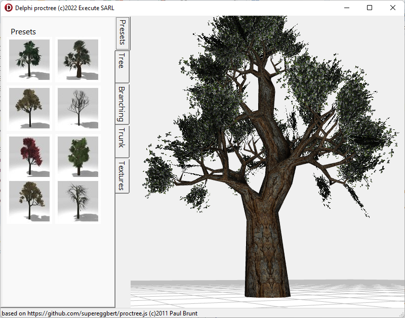
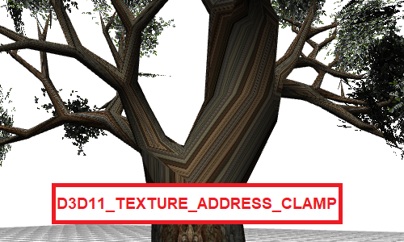
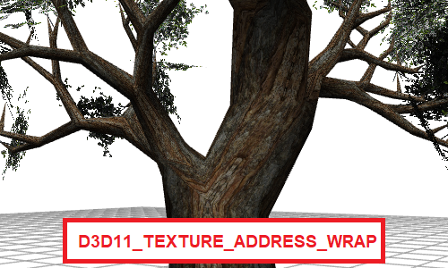

# Delphi version of proctree

Execute.Tree3D.pas is a direct translation of [proctree.js](https://github.com/supereggbert/proctree.js) by Paul Brunt.

This unit can compute the 3D Mesh of a tree based on some mathematicals parameters.



the Presets tab show some presets parameters, but you can change them on the other tabs.

the vcl directory contains a VCL application to display this mesh with OpenGL

the fmx directory contains a FMX application to display this mesh under Firemonkey.

to display the twig under FMX, I had to introduce a new Texture object that supports pixel transparency, this is achieved by adding an alpha test in the shader to discard any unwanted pixel (see Execute.TransparentTexture.pas).

```shader
float Opacity;
float Modulation;
sampler2D texture0;
struct PSInput {
 float4 Pos: POSITION;
 float4 Color: COLOR0;
 float2 Tex0: TEXCOORD0;
};
float4 main(PSInput input): COLOR {
 float4 color;
 if (Modulation == 0) color = input.Color;
 if (Modulation == 1) color = tex2D(texture0, input.Tex0);
 if (Modulation == 2) color = input.Color * tex2D(texture0, input.Tex0);
 if (color.a < 0.5) discard;  // discard any pixel with Alpha channel < 0.5, ZBuffer will not be affected !
 return color * Opacity;
}
```

the OpenGL version for VCL just uses the corresponding OpenGL functions
```delphi
  glAlphaFunc(GL_GREATER, 0.5);
  glEnable(GL_ALPHA_TEST);
```

FMX needs also a second hack to support wrapping textures, for DX11 under Windows, just copy original `FMX.Context.DX11.pas` file from Delphi source code and change the texture attributes. Since we don't change the unit interface, no other unit need to be copied.





<pre>
<i>// FMX.Context.DX11.pas</i>
...
procedure TDX11Context.SetTexture(const AUnit: Integer; const Texture: TTexture);
var
  Tex: ID3D11Texture2D;
  Desc: TD3D11_SAMPLER_DESC;
  OldResourceView: ID3D11ShaderResourceView;
  OldSampleState: ID3D11SamplerState;
begin
  SaveClearFPUState;
  try
    if FSampleStates[AUnit] = nil then
    begin
      FillChar(Desc, SizeOf(Desc), 0);
<s>      Desc.AddressU := D3D11_TEXTURE_ADDRESS_CLAMP;
      Desc.AddressV := D3D11_TEXTURE_ADDRESS_CLAMP;
      Desc.AddressW := D3D11_TEXTURE_ADDRESS_CLAMP;</s>
      Desc.AddressU := D3D11_TEXTURE_ADDRESS_WRAP;
      Desc.AddressV := D3D11_TEXTURE_ADDRESS_WRAP;
      Desc.AddressW := D3D11_TEXTURE_ADDRESS_WRAP;
...
</pre>

The application is tested under Windows for DirectX 11 only, and Linux.

The application works on Android even though the user interface is not designed for mobiles.

```FMX.Context.GLES.pas``` needs also a patch for texture wrapping.
<pre>
...
class procedure TCustomContextOpenGL.DoInitializeTexture(const Texture: TTexture);
var
  Tex: GLuint;
begin
  if Valid then
  begin
    glActiveTexture(GL_TEXTURE0);
    glGenTextures(1, @Tex);
    glBindTexture(GL_TEXTURE_2D, Tex);
<s>    glTexParameteri(GL_TEXTURE_2D, GL_TEXTURE_WRAP_S, GL_CLAMP_TO_EDGE);
    glTexParameteri(GL_TEXTURE_2D, GL_TEXTURE_WRAP_T, GL_CLAMP_TO_EDGE);</s>
    glTexParameteri(GL_TEXTURE_2D, GL_TEXTURE_WRAP_S, GL_REPEAT);
    glTexParameteri(GL_TEXTURE_2D, GL_TEXTURE_WRAP_T, GL_REPEAT);
...
</pre>

I didn't test the application under OSX or iOS (Metal) but it may work also.